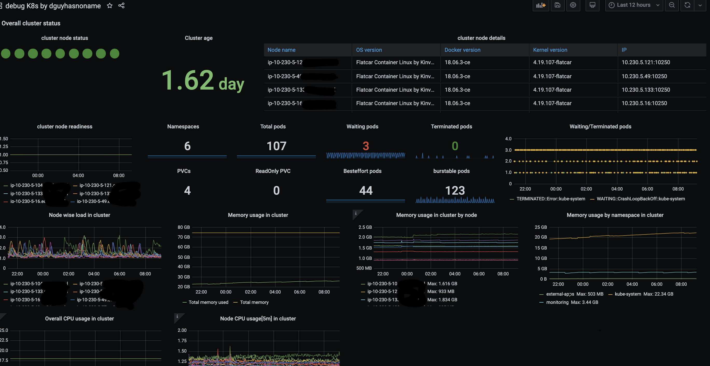
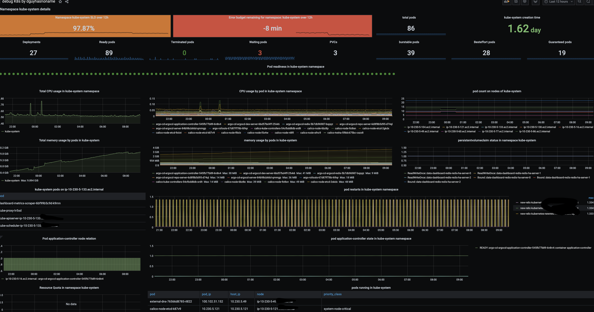

# Kubernetes cluster overview

grafana link: https://grafana.com/grafana/dashboards/11802

This dashboard shows SLO, error budget and can help troubleshooting issue in k8s cluster at cluster, node and namespace level.

Prometheus helm chart used: [stable/prometheus-operator](https://github.com/helm/charts/tree/master/stable/prometheus-operator)
Grafana version recommended: 7.0.0

Special Plugin dependencies:

- Status dot

values.yaml for operator helm chart:

```
prometheusOperator:
  createCustomResource: true

alertmanager:
  ingress:
    enabled: true
    hosts: [alertmanager.abc.com]

grafana:
  ingress:
    enabled: true
    hosts: [grafana.abc.com]
  plugins:
  - btplc-status-dot-panel

prometheus:
  ingress:
    enabled: true
    hosts: [prometheus.abc.com]
  prometheusSpec:
    replicas: 1
    podAntiAffinity: hard
    podAntiAffinityTopologyKey: failure-domain.beta.kubernetes.io/zone
    storageSpec:
      volumeClaimTemplate:
        spec:
          storageClassName: default-storage-class
          accessModes: ["ReadWriteOnce"]
          resources:
            requests:
              storage: 70Gi
    resources:
      requests:
        cpu: 200m
        memory: 1024Mi
      limits:
        cpu: 1000m
        memory: 1024Mi

# Exporters
kubeApiServer:
  enabled: true

kubelet:
  enabled: true

kubeControllerManager:
  enabled: true

coreDns:
  enabled: true

kubeDns:
  enabled: true

kubeEtcd:
  enabled: true

kubeScheduler:
  enabled: true

kubeProxy:
  enabled: true

kubeStateMetrics:
  enabled: true

nodeExporter:
  enabled: true
```

This dashboard show SLO and error budget for over all cluster/namespace and can help troubleshooting issue in k8s cluster at cluster, node and namespace level.

Cluster SLO and error budget has been calculated based on control plane pods. Namespace SLO and error budget is based on all pods running in the namespace.

At cluster level you can find below details:

- Node readiness state
- No. of pods in cluster
- memory/CPU usage in cluster: total, node-wise and namespace wise.
- PVCs in cluster and read only PVCs
- Cluster age
- Waiting/Teminated pods count
- cluster node details

At node level you can find below details:

- Uptime
- Node readiness
- CPU, memory and load on node.
- Kubelet errors which can be related to PLEG
- pod count on node by namespace
- Memory/Disk/PID pressure
- Top 5 memory guzzling pods
- NTP time deviation
- Kubelet eviction stats
- Node evictions

At namespace level you can find below details:

- pod readiness
- ready/waiting/terminated pod count
- No. of deployments in namespace
- Pod-node relation over period of time
- node wise pod count in the namespace
- pod restarts in namespace
- pod state over a period of time
- memory/cpu utilisation by pod
- resource quota in namespace





